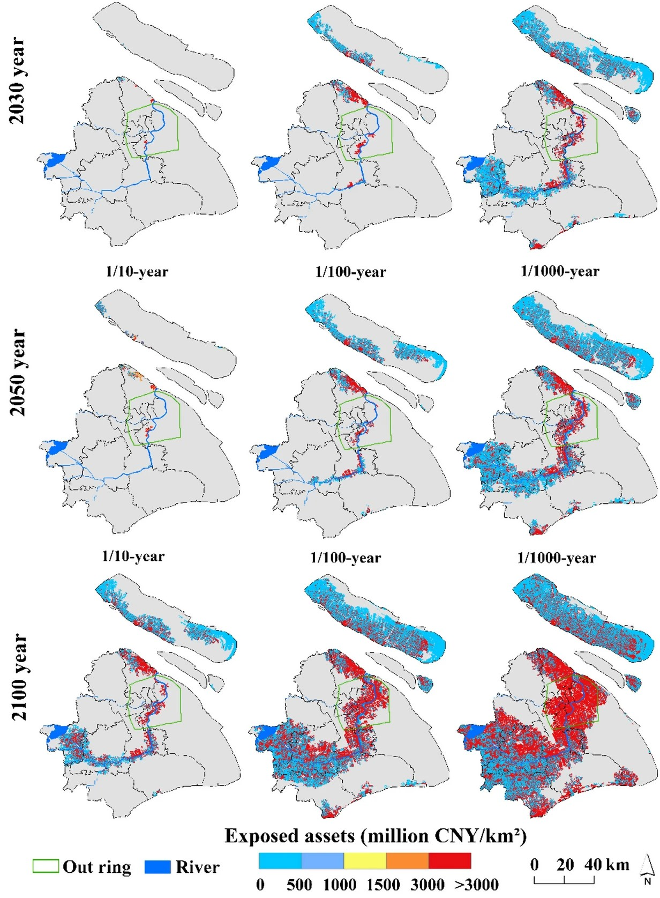

```{r setup, include=FALSE,echo=FALSE}
options(htmltools.dir.version = FALSE)
library(dplyr)
library(readr)
library(readxl)
library(knitr)
```


```{r xaringan-themer, include=FALSE, warning=FALSE}
library(xaringanthemer)
style_duo_accent(primary_color = "#0D5E74", 
                 # secondary_color = "#2881C6",
  header_font_google = google_font("Josefin Sans"),
  text_font_google   = google_font("Montserrat", "300", "300i"),
  code_font_google   = google_font("Fira Mono"),
)
```


```{r xaringan-all, echo=FALSE, warning=FALSE}
library(countdown)
library(xaringan)
library(xaringanExtra)
hook_source <- knitr::knit_hooks$get('source')
knitr::knit_hooks$set(source = function(x, options) {
  x <- stringr::str_replace(x, "^[[:blank:]]?([^*].+?)[[:blank:]]*#<<[[:blank:]]*$", "*\\1")
  hook_source(x, options)
})
xaringanExtra::use_broadcast()
xaringanExtra::use_freezeframe()
xaringanExtra::use_scribble()
#xaringanExtra::use_slide_tone()
xaringanExtra::use_search(show_icon = TRUE, auto_search	=FALSE)
xaringanExtra::use_freezeframe()
xaringanExtra::use_clipboard()
xaringanExtra::use_tile_view()
xaringanExtra::use_panelset()
xaringanExtra::use_editable(expires = 1)
xaringanExtra::use_fit_screen()
xaringanExtra::use_extra_styles(
  hover_code_line = TRUE,         
  mute_unhighlighted_code = TRUE  
)
```
# Study area


.center[More than 90% of the natural disasters experienced in Shanghai are meteorological. The number of days and intensity of heavy precipitation over the next 20 years show an increasing trend.]

---
# Study area
```{r echo=FALSE, out.width='70%', fig.align='center'}

```
The multi-level, networked and functional urban ecological space system consists of "a double ring, 9 ecological corridors and 10 ecological protection zones".

Source: Shanghai Urban Master Plan (2017-2035)
---
# Problem statement
.panelset[
.panel[.panel-name[Low-carbon development]

- Energy demand remains high, with continued development needs in the industrial, transport and construction sectors.

- While Shanghai's energy consumption as a percentage of GDP continues to decline, coal still accounts for the largest share of the energy mix.

Image credit：(Li et al. 2017)
.pull-left[
```{r echo=FALSE, out.width='80%', fig.align='left'}

```
]
.pull-right[
```{r echo=FALSE, out.width='80%', fig.align='left'}

```
]
]

.panel[.panel-name[Ecological space]
.pull-left[
- The forest coverage rate reached 15% in 2015, but it is still far from the global urban forest coverage rate of 40%- 60%, and lower than the national average of 22%.

- Urban expansion has led to the fragmentation and reduction of green space, and there is a lack of urban open space, with only 7.6 m2 of parkland per capita.

Source: Shanghai Urban Master Plan (2017-2035)
]
.pull-right[
```{r echo=FALSE, out.width='100%', fig.align='center'}

```
Image credit：(Liu et al. 2021)
]
]

.panel[.panel-name[Extreme climates]
.pull-left[
- More than 90% of the natural disasters experienced in Shanghai are meteorological. The number of days and intensity of heavy precipitation over the next 20 years show an increasing trend.

- Continuing sea level rise and upstream flood pressure are posing greater challenges to urban resilience to flooding.

Image credit：(Shan, Yin & Wang 2022)

Source: Shanghai Emergency Management 14th Five-Year Plan
]
.pull-right[
```{r echo=FALSE, out.width='90%', fig.align='center'}

```
]
]
]
---
# Policy
.panelset[
.panel[.panel-name[Internationally]
- The Paris Agreement 

- Goal: **‘to limit the temperature increase to 1.5°C above pre-industrial levels’**

- How: Early achievement of carbon peaking and subsequent carbon neutrality

  - Carbon neutrality targets (taking into account different national circumstances)
  
  - Emphasising that the 2030 goal of nationally determined contributions (NDCs) is consistent with the goal of the Paris Agreement

Source:[United Nation. 2015](https://unfccc.int/process-and-meetings/the-paris-agreement)  
]

.panel[.panel-name[Nationally]
- **National Development and Reform Commission**

- ‘Peak carbon dioxide emissions by 2030 and work towards carbon neutrality by 2060’

- By 2030:

```{r echo=FALSE, out.width='150%', fig.align='center'}

```
Source:[PRC. 2023](https://www.gov.cn/yaowen/2023-04/06/content_5750183.htm) 
]

.panel[.panel-name[Locally]
- Shanghai Municipal People's Government: **‘Shanghai Peak Carbon Implementation Programme’**

- Peak carbon emissions by 2030

- In addition to meeting national targets, **reduce carbon dioxide emissions per unit of GDP by 70 % below 2005 levels by 2030**

- Other: ***The forest cover strives to reach 21 per cent and the forest stock reaches about 11 million cubic metres***

Source:[National Development and Reform Commission. 2022](https://www.ndrc.gov.cn/fggz/hjyzy/tdftzh/202208/t20220808_1332758_ext.html)
]
]
---
class: center, middle
background-image: url(img/Workflow1.png)
background-size: contain
---
# Workflow

```{r echo=FALSE, out.width='70%', fig.align='center'}

```
- Provide a guideline for the planting location.

- Prevent unnecessary search and planning blindly.

Image credit:[Yang et al., 2023](https://link.springer.com/article/10.1007/s00376-022-2237-5)
---
# Work flow
.pull-left[
```{r echo=FALSE, out.width='150%', fig.align='left'}

```

Image credit:[ESA](https://earth.esa.int/eogateway/catalog/tansat-agcs-and-capi-products)
]
.pull-right[
- Limit resolution

- Other data is needed to combine with the study.

]
---
# Workflow
Multi Criteria Analysis:
- Environment
- Economics
- Planning
…


```{r echo=FALSE, out.width='100%', fig.align='center'}

```

Source:[Fathizad et al., 2017](https://link.springer.com/article/10.1007/s41324-016-0064-4)
---
# Carbon sink
.panelset[
.panel[.panel-name[What]
- Natural or artificial environments that absorb and store carbon. 

- Help mitigate climate change by absorbing greenhouse gases like carbon dioxide.

```{r echo=FALSE, out.width='60%', fig.align='center'}

```

Source:[Ogle, K. 2018](https://www.nature.com/articles/d41586-018-05842-2)
]

.panel[.panel-name[Why tree]
- Natural carbon sinks crucial for achieving carbon neutrality in China.

- Green spaces serve as the primary land space functioning as carbon sinks.
]
]
---
class: center, middle
background-image: url(img/Workflow2.png)
background-size: contain
---
# Timeline and budget Breakdown
```{r echo=FALSE, out.width='100%', fig.align='center'}

```
---
# Summary
.panelset[
.panel[.panel-name[Background]
**Background**
- Carbon emissions contribute to global warming, greenhouse effect, and sea level rise.

**Target**
- Shanghai reach carbon peak in *2030*


- Forest coverage *21%*  
]

.panel[.panel-name[Project aim]
- **Carbon detection system**

  - Detect CO2-density distribution spatially
  
  - Identify areas with severe carbon pollution
  
- **Vegetation suitability assessment system**

  - Assess Vegetation suitability
  
  - Select proper planting vegetation species
  
  - Validate the Project
  
- **Long-term Monitoring System**

  - Monitor co2 pollution timely
  
  - Monitor vegetation health condition timely
]
]

---

